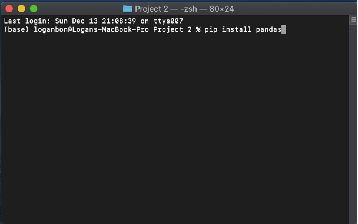

# Real Estate Data Mining - Washington, USA

## Overview
This web-scraping program performs the Extract, Transform, Load (ETL) process of real estate metadata in Washington, USA. It collects data from multiple endpoints at kingscounty.gov, all related to a unique parcel number. This project was completed for a real estate agency who found me via my [Upwork profile](https://www.upwork.com/freelancers/~0142cf8752a12b0b88?).

Data Collected:
- Occupants Full Name
- Mailing Address
- Recent Sale Price
- Lot Size
- Appraisal Value
- Acres
- Zoning
- Water
- Sewer/Septic
- Power Lines
- Water Problems
- Environmental
- Latitude/Longitude
- & more

Data collected by the script is saved to an excel file named “results.py” which downloads to the same directory that “executable.py” is executed from.

## Environment
This program requires a python 3.7.6 or greater environment. I recommend downloading [Anaconda](https://www.anaconda.com/products/individual). You can navigate to the Anaconda Installers page to download the package that is right for you.

We will be executing our code in the **Shell**. Use the *Terminal* if you are on a Mac or *Bash* if you are using a Windows. We need to run a few installation commands from the *Terminal* or *Bash* window before running the standalone executable.

If you are on a Mac, the *Terminal* is already installed and ready to use. If you are on a Windows, you may need to enable *Bash* before it is ready for use. This article will help you [enable *Bash*](https://www.laptopmag.com/articles/use-bash-shell-windows-10) if you are exeriencing issues.

Another environmental requirement of this program is a WebDriver. This program uses *ChromeDriver* which is compatible with the Chrome Browser (Mac, Linux, Windows and ChromeOS). You can download a *ChromeDriver* file [here](https://chromedriver.chromium.org/downloads). You must choose the correct *ChromeDriver* version based on your Chrome Browser's version number. This article will help you find your [Chrome Browser's version number](https://help.zenplanner.com/hc/en-us/articles/204253654-How-to-Find-Your-Internet-Browser-Version-Number-Google-Chrome).

After you’ve download the *ChromeDriver* file, you must move it to it’s proper directory within your operating system. You can do this using a *Terminal* or *Bash* window or from your computer's Finder or File Explorer UI. If you choose to do this using *Terminal* or *Bash*, execute this command from a window located in your downloads directory.

`mv chromedriver /usr/local/bin/`

**The *Terminal* or *Bash* window must be located in the downloads directory**

To check if the *ChromeDriver* file was moved to the correct directory, type `/usr/local/bin/` into your browser's http search bar to show the contents of this directory.

You should see *ChromeDriver* now sitting in this directory.

## Installing Library Dependencies
Next, we need to install our program’s dependencies to our local environment. You can execute these commands from any *Terminal* or *Bash* window:

1.	pip install pandas
2.	pip install beautifulsoup4
3.	pip install splinter

If the packages are installed correctly you will receive a ‘successful installation’ print out after each installation.

## Executing the program
After you have installed the necessary environmental and code dependencies you are ready to execute the code. We will use a *Terminal* or *Bash* window to complete this process.

Input File Requirements:
1.	An excel file titled “parcels.xlsx” located in the same directory as “executable.py”
    - Contains all parcel id’s in a field with header == “PARCEL_ID”
    - There can be other fields in the input file but the parcel id’s must be under the field name “PARCEL_ID”.
    - This program will not alter the input file.

Before executing the program our *Terminal* or *Bash* window must be located in the directory which holds both the input file and executable. To be sure you are in the right directory, use the `ls` command which will print out the file names located in your *Terminal* or *Bash* window’s current directory. It should hold both “executable.py” and “parcels.xlsx”.

If your current directory contains the necessary requirements, you can now execute the program. On a Mac, use the command:

`python executable.py`. 

On a Windows, use:

 `python3 executable.py` OR `sudo python3 executable.py`. 

Within a few seconds a new Chrome Browser window will launch and start navigating the web independently. In the *Terminal* or *Bash* window from which the code was executed, you will see a update statement print after data collection is complete for each parcel id. Once the program is finished a new excel file named “results.xlsx” will download to the same directory which holds “executable.py“ and “parcels.xlsx”.

## Disclaimer
Any web-scraping script depends on the code configuration of the website it is scraping. If decided necessary, website administrators can attempt to prevent web-scraping by making changes to their website’s code configuration. If this happens, it may break the script and the code will need to be updated. If you start receiving errors or notice data is not loading properly, this may be the case.

