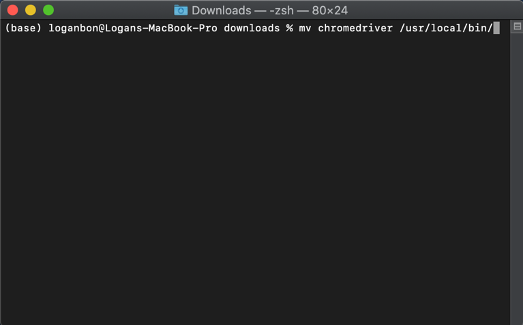

# Mining Real Estate Information - Washington, USA

## Overview
This web scraping program performs the Extract, Transform, Load (ETL) process of real estate metadata in Washington, USA. It collects data from multiple endpoints at kingscounty.gov, all related to a unique parcel number. This project was completed for a real estate agency client who found me via my [Upwork profile](https://www.upwork.com/freelancers/~0142cf8752a12b0b88?).

Data Collected:
- Occupants Full Name
- Mailing Address
- Lot Size
- Appraisal Value
- Acres
- Zoning
- Water
- Sewer/Septic
- Power Lines
- Water Problems
- Environmental
- Latitude/Longitude
- & more

All collected information is saved to an excel file named “results.py”. It downloads to the same directory that “executable.py” is executed from.

## Disclaimer
Any web-scraping script depends on the code configuration of a website. If decided necessary, website administrators can attempt to prevent web-scraping by making changes to their website’s code configuration. If this happens, it may break the script and the code will need to be updated. If you start receiving errors or notice data is not loading properly, this may be the case.

## Environment
This program requires a python 3.7.6 or greater environment. I recommend downloading anaconda from the [Anaconda](https://www.anaconda.com/products/individual). You can navigate to the Anaconda Installers page to download the package that is right for you.

We will be executing our code in the **Shell**. Use the *Terminal* if you are on a Mac or *Bash* if you are using a Windows. We need to run a few installation commands from the Terminal or Bash window before running the standalone executable.

If you are on a Mac, the Terminal is already installed and ready to use. If you are on a Windows, you may need to enable Bash before it is ready for use. This article may help you if you have any questions related to enabling [Bash](https://www.laptopmag.com/articles/use-bash-shell-windows-10).

Another environmental requirement of this program is a WebDriver. This program uses a ChromeDriver which is compatible with the Chrome Browser on Desktop (Mac, Linux, Windows and ChromeOS). You will need to download a ChromeDriver from [ChromeDriver download](https://chromedriver.chromium.org/downloads). 

You must choose the correct ChromeDriver version based on the version of the Chrome Browser you are using. This article will help you find your Chrome Browser's [version number](https://help.zenplanner.com/hc/en-us/articles/204253654-How-to-Find-Your-Internet-Browser-Version-Number-Google-Chrome). 

After you’ve download the ChromeDriver, you need to move it to it’s proper directory within your operating system. We will do this using a Terminal or Bash window. Execute this command from a Terminal or Bash window located in your downloads directory

`mv chromedriver /usr/local/bin/`

**The Terminal window must be located in the downloads directory**
*The Below image is an example of completing the move command on a Terminal window with Mac OS.*

To check if the chromedriver file was moved to the correct directory, type */usr/local/bin/* into your browser window search box to show the contents of this directory.

You should see chromedriver now sitting in this directory.

## Installing Library Dependencies
Next, we need to install our program’s dependencies to our local environment, which it uses to navigate the web and collect data. You will need to run these commands from any Terminal or Bash window:

1.	pip install pandas
2.	pip install beautifulsoup4
3.	pip install splinter

If the packages are installed correctly you will receive a ‘successful installation’ print out after each installation.

## Executing the program
After you have installed the necessary environmental and code dependencies you are ready to execute the code. We will use a Terminal or Bash window to complete this process. The Terminal or Bash window must be located in the directory which contains both the input file and the executable. 

Input File Requirements:
1.	An excel file titled “parcels.xlsx” located in the same directory as “executable.py”
    - Contains parcel id’s in a field titled “PARCEL_ID”
    - There can be other fields in the input file but the parcel id’s must be under the field name “PARCEL_ID”.
    - This program will not alter the input file.

You will execute the program from a Terminal or Bash window located in the directory which holds both the input file and executable. You can be sure you are in the right directory by using the ls command, which will print out the document names located in your Terminal or Bash window’s current directory. It should hold both “executable.py” and “parcels.xlsx”.

If your directory contains the necessary requirements, you can now execute the program. On a Mac, use the command `python executable.py`. On a Windows, use `python3 executable.py` OR `sudo python3 executable.py`. 

The program will begin running and within a few seconds you should see a new Google Chrome Browser open and begin navigating the web on its own. In the Terminal or Bash window you executed the code from, you will see a count statement print after web scraping is completed for an individual parcel id. Once the program is complete, a new excel file titled “results.xlsx” will download to the same directory which holds “executable.py“ and “parcels.xlsx”.
